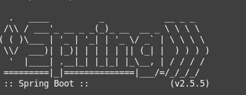

# Yandex.Bookmarks (SE study project, Fall 2021) 
[](https://github.com/kkarnauk/se-project-fall-2021/actions/workflows/build.yml)
[](https://www.gnu.org/licenses/agpl-3.0)

Provides a service for buying books (single ones and subscriptions) to read them online inside Yandex.Go system.

The project in the initial stage and cannot be used now.

## Disclaimer
It's a study project in Higher School of Economics university for SE course. 
This project is not supposed to be implemented after all.

### Presentation
[Presentation](https://docs.google.com/presentation/d/1i_aqm273EMzhUOqtvA9vfnnG4NX9V2NxKjlsAt63Uac/edit?usp=sharing)
about purposes of Yandex.Bookmarks.

## Roadmap
You can find it on [GitHub Projects](https://github.com/kkarnauk/se-project-fall-2021/projects/1).

## Using locally
This project uses [Gradle](https://gradle.org/). You can run it with just a simple command:
```bash
./gradlew bootRun
```
You can run tests as well:
```bash
./gradlew test
```

## Docker
There are two Dockerfiles for running tests and creating minimal image to launch the application.

Go to dockerfile folder
```shell
cd dockerfile
```
Run
```shell
docker build -t build-bookmarks -f build.Dockerfile .
```
to build application and run tests.

Or run
```shell
docker build -t minimal-to-run-bookmarks -f minimalToRun.Dockerfile .
```
and then run the image `minimal-to-run-bookmarks`
```shell
docker run minimal-to-run-bookmarks
```
You will see Spring Boot console logo


## Contributors
Peter Surkov (@psurkov)

Egor Lebedev (@LebedevEA)

Kirill Karnaukhov (@kkarnauk)

## Licence
[GNU AGPLv3](https://choosealicense.com/licenses/agpl-3.0/)
